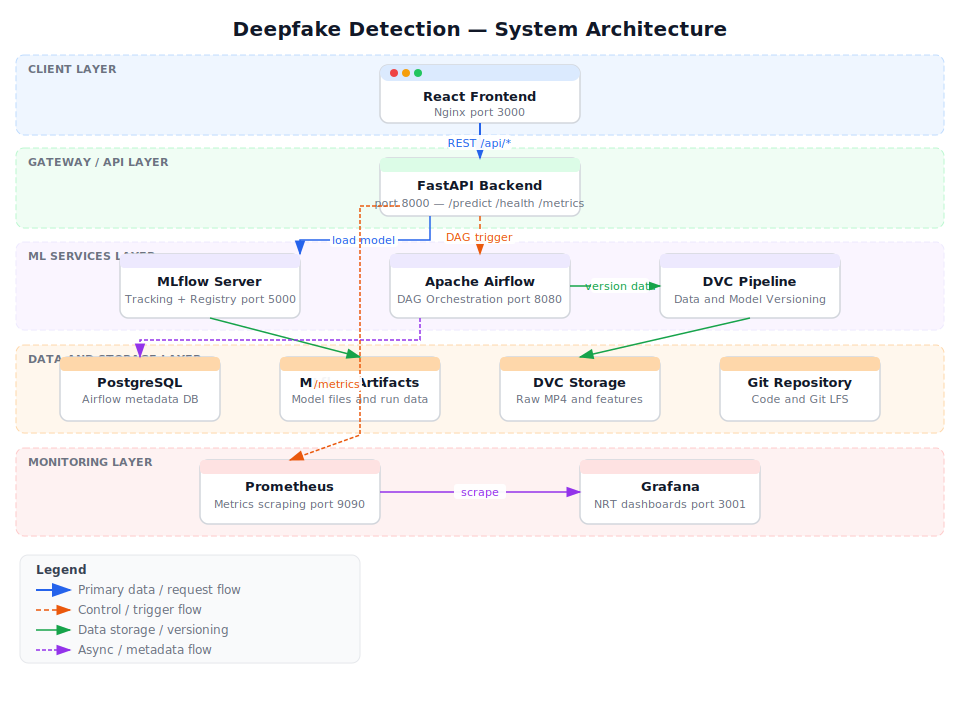
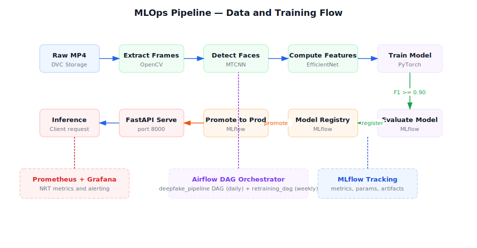
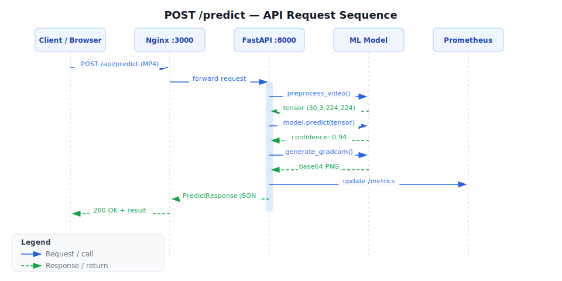
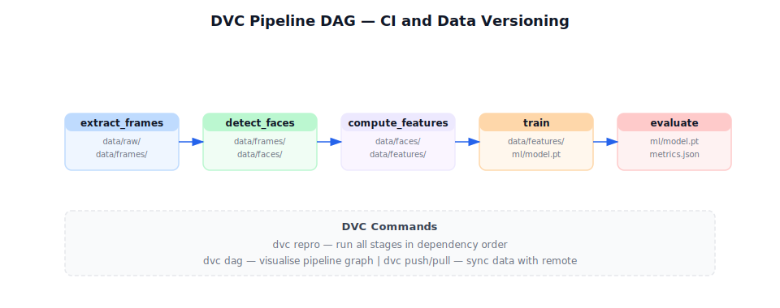
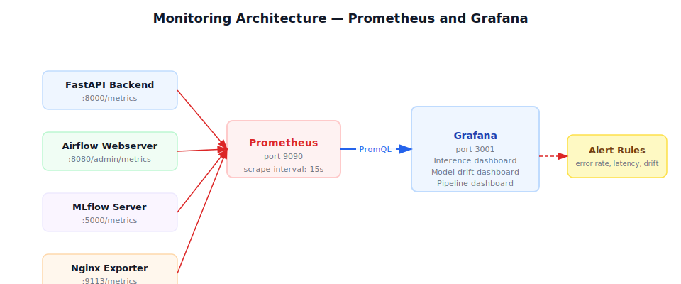

# Deepfake Detection System

A production-grade MLOps system for detecting deepfake videos using a PyTorch model trained on face-extracted frames. The ML pipeline automates data ingestion, preprocessing, model training, and evaluation through Apache Airflow DAGs and DVC, with experiment tracking and model versioning via MLflow. The ops stack provides a FastAPI backend, React frontend, and comprehensive monitoring with Prometheus and Grafana — all orchestrated with Docker Compose for seamless local and production deployment.

---

## Table of Contents

1. [Screenshots](#screenshots)
2. [Architecture](#architecture)
   - [Pipeline Flow](#pipeline-flow)
   - [API Flow](#api-flow)
   - [DVC DAG](#dvc-dag)
   - [Monitoring](#monitoring)
3. [Prerequisites](#prerequisites)
4. [First-Time Setup](#first-time-setup)
5. [Service URLs](#service-urls)
6. [Development Workflow](#development-workflow)
7. [Rollback Procedure](#rollback-procedure)
8. [Security Notes](#security-notes)
9. [Project Structure](#project-structure)

---

## Screenshots

### Landing Page


### Deepfake Detection Result


### Detection with Heatmap Overlay


### User Stats Dashboard


### MLflow Experiment Tracking


### Airflow Pipeline DAG


---

## Architecture



> Full interactive diagram: open [docs/architecture.html](docs/architecture.html) in a browser.

### Pipeline Flow



### API Flow



### DVC DAG



### Monitoring



---

## Prerequisites

| Requirement | Minimum Version | Notes |
|---|---|---|
| Docker | 24.0+ | `docker --version` |
| Docker Compose | v2.0+ | `docker compose version` (note: `docker compose`, not `docker-compose`) |
| Git | any | — |
| Git LFS | any | `git lfs install` |
| Python | 3.11+ | Only needed for running tests locally outside Docker |
| RAM | 8 GB+ | All services running concurrently |

Install Git LFS if not present:
```bash
# macOS (Homebrew)
brew install git-lfs

# Ubuntu/Debian
sudo apt install git-lfs

# Windows (Chocolatey)
choco install git-lfs
```

---

## First-Time Setup

Follow these steps in order. Each step must succeed before proceeding to the next.

### Step 1 — Clone the repository

```bash
git clone <repository-url>
cd deepfake-detection
git lfs pull          # download large model/data files tracked by Git LFS
```

### Step 2 — Configure environment variables

```bash
cp .env.example .env
```

Open `.env` and change the following values — **do not leave them as `changeme`**:

| Variable | Why it must be changed |
|---|---|
| `POSTGRES_PASSWORD` | Database password; default is insecure |
| `GRAFANA_ADMIN_PASSWORD` | Grafana admin password; default is insecure |
| `AIRFLOW__CORE__FERNET_KEY` | Must be a valid Fernet key; see generation below |

All other values can remain at their defaults for local development.

**Generate a Fernet key** (requires the `cryptography` package):

```bash
python -c "from cryptography.fernet import Fernet; print(Fernet.generate_key().decode())"
```

Copy the output and set it as the value of `AIRFLOW__CORE__FERNET_KEY` in `.env`.

### Step 3 — Start infrastructure services

Start the database and message broker first, then initialize Airflow (this runs a one-time DB migration and creates the admin user), then bring up the MLflow tracking server:

```bash
docker compose up -d postgres redis
docker compose up airflow-init          # wait for this to finish (exit code 0)
docker compose up -d mlflow-server
```

Verify Airflow initialized successfully:

```bash
docker compose ps airflow-init          # Status should be "Exited (0)"
```

### Step 4 — (Optional) Run the Airflow DAG to populate data

Place one or more test MP4 files in `data/landing/`, then trigger the pipeline DAG:

```bash
docker compose run --rm airflow-worker airflow dags trigger deepfake_pipeline
```

Monitor progress in the Airflow UI at http://localhost:8080 (credentials: `admin` / `admin`).

### Step 5 — Train the initial model

```bash
docker compose run --rm ml python ml/train.py
```

This registers the trained model in MLflow. Confirm it appears in the MLflow UI at http://localhost:5000 under **Models → deepfake**.

### Step 6 — Promote the model to Production

The model server only serves models in the **Production** stage. Promote using either method:

**Method A — MLflow UI:**

1. Open http://localhost:5000
2. Navigate to **Models → deepfake → Version 1**
3. Click **Stage → Transition to Production**

**Method B — CLI:**

```bash
docker compose run --rm mlflow-server \
  mlflow models transition-model-version-stage \
    --name deepfake \
    --version 1 \
    --stage Production
```

### Step 7 — Start all remaining services

```bash
docker compose up -d
```

Wait approximately 30–60 seconds for all services to become healthy before running smoke tests.

### Step 8 — Smoke tests

Run each of the following to confirm the system is operational:

```bash
# Backend health check
curl http://localhost:8000/health

# Backend readiness check (confirms model is loaded)
curl http://localhost:8000/ready

# Predict on a sample video
curl -X POST http://localhost:8000/predict \
  -F "file=@sample.mp4" | python -m json.tool

# Confirm Prometheus is scraping targets
curl http://localhost:9090/api/v1/targets | python -m json.tool

# Open frontend in browser
open http://localhost:3000          # macOS
# xdg-open http://localhost:3000   # Linux
# start http://localhost:3000      # Windows
```

---

## Service URLs

| Service | URL | Default Credentials |
|---|---|---|
| React Frontend | http://localhost:3000 | — |
| FastAPI Backend | http://localhost:8000 | — |
| Backend API Docs | http://localhost:8000/docs | — |
| MLflow UI | http://localhost:5000 | — |
| Airflow UI | http://localhost:8080 | `admin` / `admin` |
| Prometheus | http://localhost:9090 | — |
| Grafana | http://localhost:3001 | `admin` / value of `GRAFANA_ADMIN_PASSWORD` in `.env` |

---

## Development Workflow

### Run the full test suite

```bash
pytest tests/ -v --tb=short
```

Unit and integration tests live under `tests/unit/` and `tests/integration/` respectively.

### Run tests for a specific module

```bash
pytest tests/unit/test_model.py -v
pytest tests/integration/test_predict_endpoint.py -v
```

### Lint and format

The project uses `black` for formatting, `isort` for import ordering, and `flake8` for linting (all configured in `pyproject.toml`).

```bash
# Format code
black .
isort .

# Lint
flake8 .
```

### Rebuild a single service after code changes

```bash
docker compose build backend
docker compose up -d backend
```

### View logs

```bash
docker compose logs -f backend
docker compose logs -f airflow-scheduler
```

---

## Rollback Procedure

If a newly promoted model causes errors:

1. **Demote the bad version in MLflow:**

   ```bash
   docker compose run --rm mlflow-server \
     mlflow models transition-model-version-stage \
       --name deepfake \
       --version <bad_version> \
       --stage Archived
   ```

2. **Promote the previous good version** using either the MLflow UI (http://localhost:5000) or the CLI command above with `--stage Production`.

3. **Force the backend to reload the model** without restarting the container:

   ```bash
   curl -X POST http://localhost:8000/admin/reload-model
   ```

---

## Security Notes

- **Host filesystem encryption is required** before running this system in any environment that processes real data. Use BitLocker (Windows), FileVault (macOS), or LUKS (Linux).
- **`.env` is never committed to version control.** It is listed in `.gitignore`. Never add it manually.
- Change all `changeme` defaults in `.env` before first use. Using default credentials in a networked environment is a security risk.
- The Airflow default credentials (`admin`/`admin`) should be changed for any non-local deployment.

---

## Project Structure

```
deepfake-detection/
├── backend/                  # FastAPI application
│   ├── app/                  # Route handlers, schemas, model loading logic
│   ├── Dockerfile
│   └── requirements.txt
├── frontend/                 # React + TypeScript UI (served by Nginx)
│   ├── src/
│   ├── nginx.conf
│   └── Dockerfile
├── ml/                       # Model training and evaluation
│   ├── train.py              # Entry point: trains model, logs to MLflow
│   ├── model.py              # PyTorch model definition
│   ├── preprocessing_pipeline.py  # Frame extraction and face detection
│   ├── data_loader.py        # Dataset loading utilities
│   ├── evaluate.py           # Evaluation metrics
│   ├── drift_baseline.py     # Data drift baseline computation
│   ├── MLproject             # MLflow project definition
│   ├── dvc.yaml              # DVC pipeline stages
│   └── params.yaml           # Hyperparameters
├── airflow/
│   ├── dags/                 # Airflow DAG definitions
│   └── plugins/              # Custom Airflow operators/hooks
├── data/
│   ├── landing/              # Drop raw MP4s here for ingestion
│   ├── raw/                  # DVC-tracked raw data
│   ├── frames/               # Extracted video frames
│   ├── faces/                # Cropped face images
│   └── features/             # Computed feature vectors
├── monitoring/
│   ├── prometheus.yml        # Prometheus scrape config
│   ├── alert_rules.yml       # Alerting rules
│   └── grafana/              # Grafana dashboard provisioning
├── tests/
│   ├── unit/                 # Unit tests (model, preprocessing, schemas)
│   └── integration/          # Integration tests (API endpoints)
├── docs/                     # Additional documentation
├── docker-compose.yml        # Main service definitions
├── docker-compose.override.yml  # Local development overrides
├── pyproject.toml            # Python tooling config (black, isort, flake8, pytest)
└── .env.example              # Environment variable template
```

---

## License

Proprietary — All rights reserved
